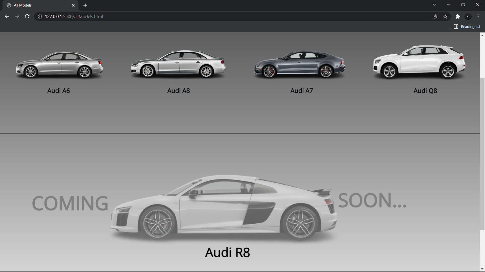

## Audi Sample Site

This is a sample site of Audi which was developed by me and designed by my friend.
You can contact the designer of this site here - [LinkedIn - @ShivanshSingh](https://www.linkedin.com/in/shivansh-singh-350987222/)

* This site is non responsive
* It is a modernised site with the authentic look

### Technologies Used:
1.HTML
2.CSS

### Things I've to Improve in this:
1.Reduce the number of modules
2.Make it responsive

### Screenshots:

